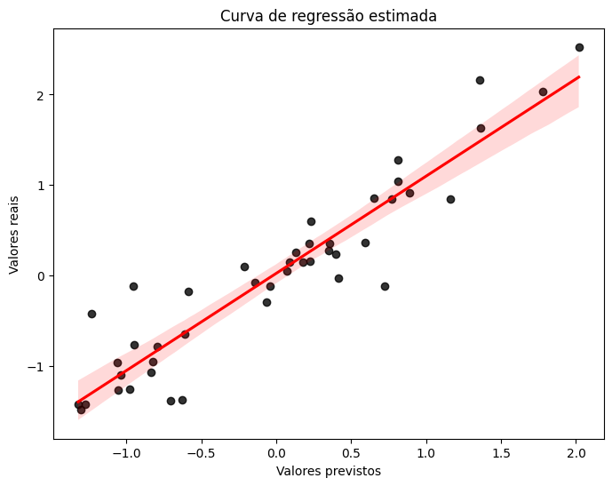
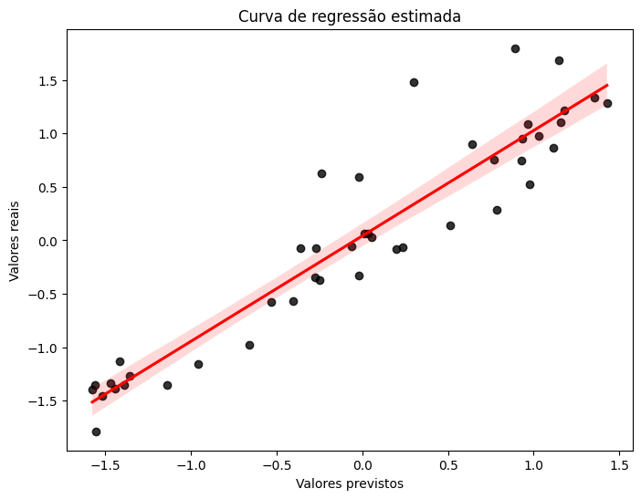
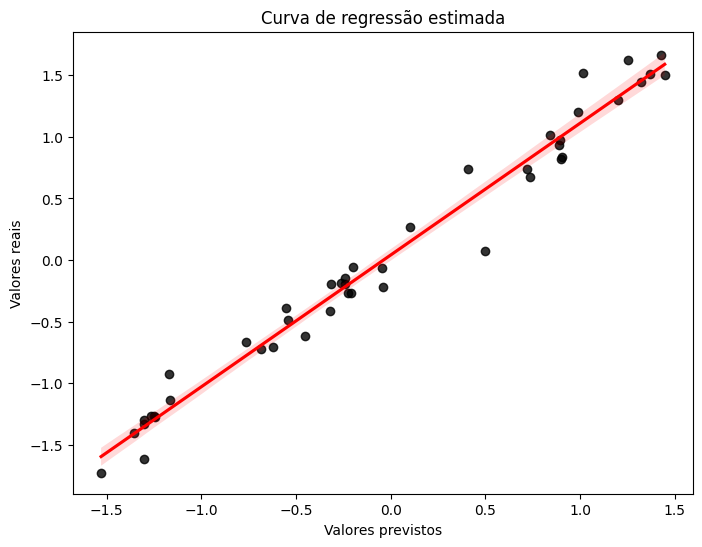
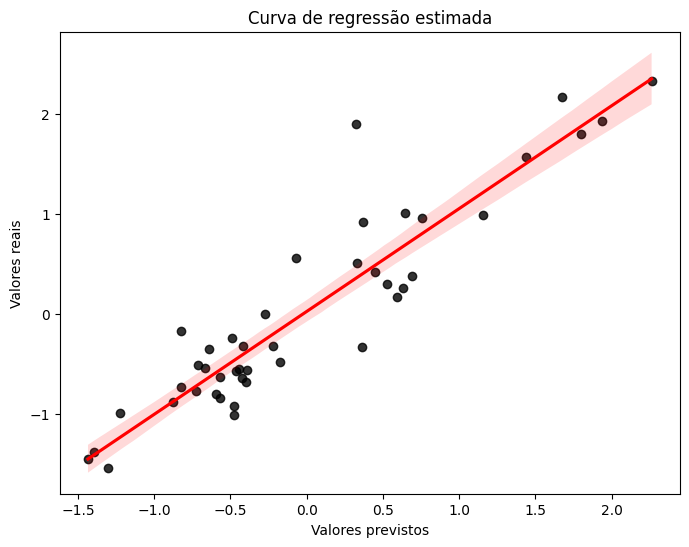

# Previsão de demanda de estoque de medicamentos controlados

**Objetivo:** Desenvolver um modelo de ML que seja capaz de prever a demanda de medicamentos controlados de Belo Horizonte - MG.

**Fonte de dados:** Utilização da base de dados publica do SNGPC (Sistema Nacional de Gerenciamento de Produtos Controlados).

Dados -> https://dados.gov.br/dados/conjuntos-dados/venda-de-medicamentos-controlados-e-antimicrobianos---medicamentos-industrializados

**Resultados:**

SKUs que tem boas regressões:
- HEMIFUMARATO DE QUETIAPINA 25 MG COM REV CT BL AL PLAS OPC X 30: Random Forest com 70% e 0.6252 de rmse

- HEMITARTARATO DE ZOLPIDEM 10 MG COM REV CT BL AL PLAS OPC X 20: RNA com 73% de r2 e 0.5198 de rmse

- HEMITARTARATO DE ZOLPIDEM 10 MG COM REV CT BL AL PLAS OPC X 30: Random Forest com 96% e 0.2246 de rmse

- CLORIDRATO DE SERTRALINA 50 MG COM REV CT BL AL PLAS OPC X 30: RNA com 93% de r2 e 0.2357 de rmse

